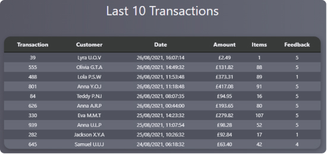
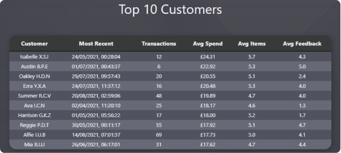
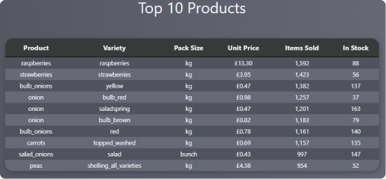
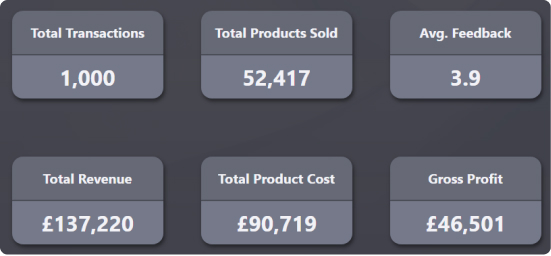

# Exercises (Section 6 - Sequel-Mart Exercises):

These exercises are designed to populate the missing sections of the front page of the sample website.

For each exercise, you will will need to:
- Create an SQL query that generates the data we need
- Convert that query into a `VIEW`
- Copy/paste the code to the relevant section in the `'backend/routes'` folder
- Refresh the web-page and see if the data exists is shown!

---
## 6.1 - Transactions
In pg-admin, create some SQL that:
1. Groups data by
	- sale id (Sales_Header)
	- date sale (Sales_Header)
	- customer name (Customers)
	- feedback score (Sales_Headers)
2. Sums the total revenue (Sales Detail)
3. Sums the items sold (Sales Detail)
4. Orders the data by the ‘date sale’ with the most recent date first
5. Limits the output to the first 10 rows only

Then:

6. Convert this SQL script into a view
7. Append this code into the space provided in line 13 of `backend/routes/transactions.js`

If all has gone well, you should see the following on the website:

---
## 6.2 - Customers ...
In pg-admin, create some SQL that:
1. Groups data by
	- customer name (Customers)
2. Most recent date sale (Sales Detail) (HINT: Use the MAX aggregator for this)
3. Count the number of sale ids for that customer (Sales Header)
4. Average revenue for that customer (Sales Detail)
5. Average number of items sold (Sales Detail)
6. Average feedback score (Sales Header)
7. Orders the average revenue with the highest value first
8. Limit the output to the first 10 rows only

Then:

9. Convert this SQL script into a view
10. Append this code into the space provided in line 13 of `backend/routes/customers.js`

If all has gone well, you should see the following on the website:

---
## 6.3 - Products ...
In pg-admin, create some SQL that:
1. Groups data by
	- product item (Products)
	- product variety (Products)
	- pack size (Products)
	- Unit Sales Price (Product)
	- Inventory (Product)
3. Sums the total of all products sold (Sales Detail) (HINT: Needs to connect to Sales Header)
4. Orders the sum of products sold with the highest value first
5. Limit the output to the first 10 rows only

Then:

6. Convert this SQL script into a view
7. Append this code into the space provided in line 13 of `backend/routes/products.js`

---
## 6.4 - Summary ...
In pg-admin, create some SQL that:
1. Counts the number of distinct (unique) transactions in the Sales Header table
2. Sums the total number of items sold in the Sales Detail table
3. Averages the total feedback from each unique transaction (Sales Header)
4. Sums the total revenue (Sales Detail)
5. Sums the cost of sales (Sales Detail)
6. Calculates the gross profit (total revenue - total cost of sales)

Then:

7. Convert this SQL script into a view
8. Append this code into the space provided in line 13 of `backend/routes/summary.js`

*HINT: Remember the section about **Nested Statements**?  Here’s where it shines!*

If all has gone well, you should see the following on the website:

